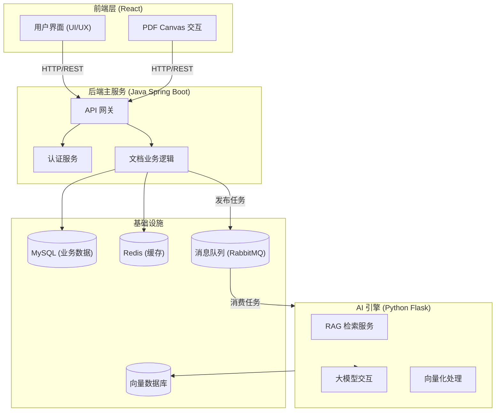

# DocuMind AI — 智能文档处理与分析中台

> 一个融合 **PDF 高级交互** + **大模型 RAG** + **微服务架构** 的全栈 AI 中台实战项目。


## 🌟 核心亮点 (Project Highlights)

本项目旨在对标企业级 AI 中台开发标准，采用 **Java (API)** + **Python (AI)** 双引擎架构：

- **深度 PDF 交互 (Frontend Focus)**: 基于 `PDF.js` + `Fabric.js` 实现高性能文档渲染、文本精准选定及画布级交互。
- **Java 主业务服务**: 使用 **Spring Boot** 处理用户鉴权、文档管理 (CRUD) 及高并发 API 请求，基于 MySQL 持久化数据。
- **Python AI 引擎**: 集成 `LangChain` + `RAG`，作为独立微服务处理文档向量化、摘要生成及智能问答。
- **高可用分布式架构**: 通过消息队列 (RabbitMQ/Kafka) 实现 Java 与 Python 服务间的异步解耦与削峰填谷。
- **AI 工程化实践**: 全流程采用 **Trae** (AI Native IDE) 辅助编码。

## 🛠️ 技术栈 (Tech Stack)

| 领域 | 核心技术 | 关键特性/应用场景 |
|------|----------|-------------------|
| **前端 (Frontend)** | **React 19** + TypeScript + Vite | 高性能组件化开发 |
| | Ant Design Pro + TailwindCSS | 企业级 UI 设计规范 |
| | **PDF.js + Fabric.js** | Canvas 级文档渲染、选区交互 |
| **后端 (Backend)** | **Java Spring Boot** | **主 API 网关**，用户认证，CRUD 业务 |
| | MyBatis-Plus / JPA | 数据库 ORM (MySQL) |
| **AI 引擎 (AI-Engine)** | **Python 3.12 + Flask** | **AI 计算服务**，RAG 检索增强生成 |
| | **LangChain** + LLM | 大模型编排与调用 |
| **中间件** | **RabbitMQ / Kafka** | 跨语言服务通信，异步任务调度 |
| | **Redis** | 分布式缓存，Session 管理 |
| **数据存储** | **MySQL** | 关系型业务数据存储 |
| | ChromaDB / Milvus | 向量数据库，Embedding 存储 |
| | MinIO | 对象存储 (OSS)，海量 PDF 文件管理 |

## 🏗️ 系统架构图



## 🚀 快速启动

### 1. 目录说明
- `backend/`: Java Spring Boot 主服务
- `ai-engine/`: Python AI 计算服务
- `frontend/`: React 前端应用

### 2. 启动步骤

```bash
# 1. 启动基础设施 (MySQL, Redis, MQ)
docker-compose up -d

# 2. 启动 Java 后端
cd backend
./mvnw spring-boot:run

# 3. 启动 Python AI 引擎
cd ai-engine
# 确保已安装依赖 (参考 ai-engine/README.md)
python run.py

# 4. 启动前端
cd frontend
npm install && npm run dev
```

## 📚 文档目录

- [`docs/api.md`](./docs/api.md) — 接口文档
- [`docs/architecture.md`](./docs/architecture.md) — 系统详细架构设计
- [`docs/database.md`](./docs/database.md) — 数据库设计

## 📄 License

MIT © 2026 DocuMind Team
