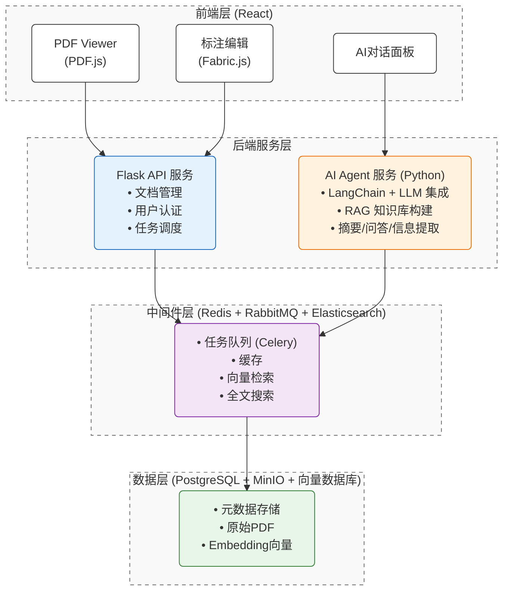

# DocuMind AI — 智能文档处理与分析中台

> 一个融合 **PDF 高级交互** + **大模型 RAG** + **分布式异步调度** 的全栈 AI 中台实战项目。
> 专为展示 **React (Frontend-First)** + **Python** 全栈架构能力及 **AI 辅助工程化** 实践而设计。


## 🌟 核心亮点 (Project Highlights)

本项目旨在对标企业级 AI 中台开发标准，覆盖从前端复杂交互到后端高可用架构的全链路实现：

- **深度 PDF 交互 (Frontend Focus)**: 基于 `PDF.js` + `Fabric.js` 实现高性能文档渲染、文本精准选定、拖拽批注及画布级交互，解决复杂单页应用 (SPA) 难点。
- **AI Agent 智能中台**: 集成 `LangChain` + `RAG`，实现文档摘要、智能问答与结构化信息提取，构建垂直领域知识库。
- **高可用分布式架构**: 采用 `Redis` (缓存/锁) + `RabbitMQ` (削峰填谷) + `Celery` (异步任务) + `Elasticsearch` (全文检索)，确保系统的高并发与扩展性。
- **AI 工程化实践**: 全流程采用 **Trae** (AI Native IDE) 辅助编码，实践 AI 驱动的研发提效与代码质量优化。
- **DevOps 与部署**: 包含完整的 Docker 容器化编排与 CI/CD 流程设计，支持云原生环境快速交付。

## 🛠️ 技术栈 (Tech Stack)

| 领域 | 核心技术 | 关键特性/应用场景 |
|------|----------|-------------------|
| **前端 (Core)** | **React 19** + TypeScript + Vite | 高性能组件化开发，Hooks 状态管理 |
| | Ant Design Pro + TailwindCSS | 企业级 UI 设计规范，响应式布局 |
| | **PDF.js + Fabric.js** | **Canvas 级文档渲染、选区交互、标注绘制** |
| **后端** | Python 3.12 + **Flask** | 轻量级微服务 API，RESTful 规范 |
| | **LangChain** + OpenAI/Qwen | LLM 编排，RAG 检索增强生成 |
| **中间件** | **RabbitMQ + Celery** | 异步任务调度，解耦耗时操作 |
| | **Redis** | 分布式缓存，Session 管理 |
| | **Elasticsearch** | 海量日志分析与全文检索 |
| **数据存储** | PostgreSQL | 关系型元数据存储 |
| | ChromaDB / Milvus | 向量数据库，Embedding 存储 |
| | MinIO | 对象存储 (OSS)，海量 PDF 文件管理 |
| **工程化** | **Docker + Docker Compose** | 容器化部署，环境一致性 |
| | **Trae** | AI 结对编程，代码生成与优化 |

## 🏗️ 系统架构图



## 🚀 快速启动

### 前置要求
- Docker & Docker Compose
- Node.js >= 22
- Python >= 3.9

### 启动步骤

```bash
# 1. 克隆仓库
git clone https://github.com/your-username/documind-ai.git
cd documind-ai

# 2. 启动后端及依赖服务（PostgreSQL, Redis, RabbitMQ）
cd backend
docker-compose up --build -d

# 3. 安装前端依赖并启动开发服务器
cd ../frontend
npm install
npm run dev
```

> 前端访问地址：http://localhost:3000  
> 后端 API 地址：http://localhost:5000

## 📚 文档目录

- [`docs/api.md`](./docs/api.md) — 接口文档（含 AI 问答、PDF 上传等）
- [`docs/deployment.md`](./docs/deployment.md) — 生产环境部署手册

## 📄 License

MIT © 2026 DemoTao