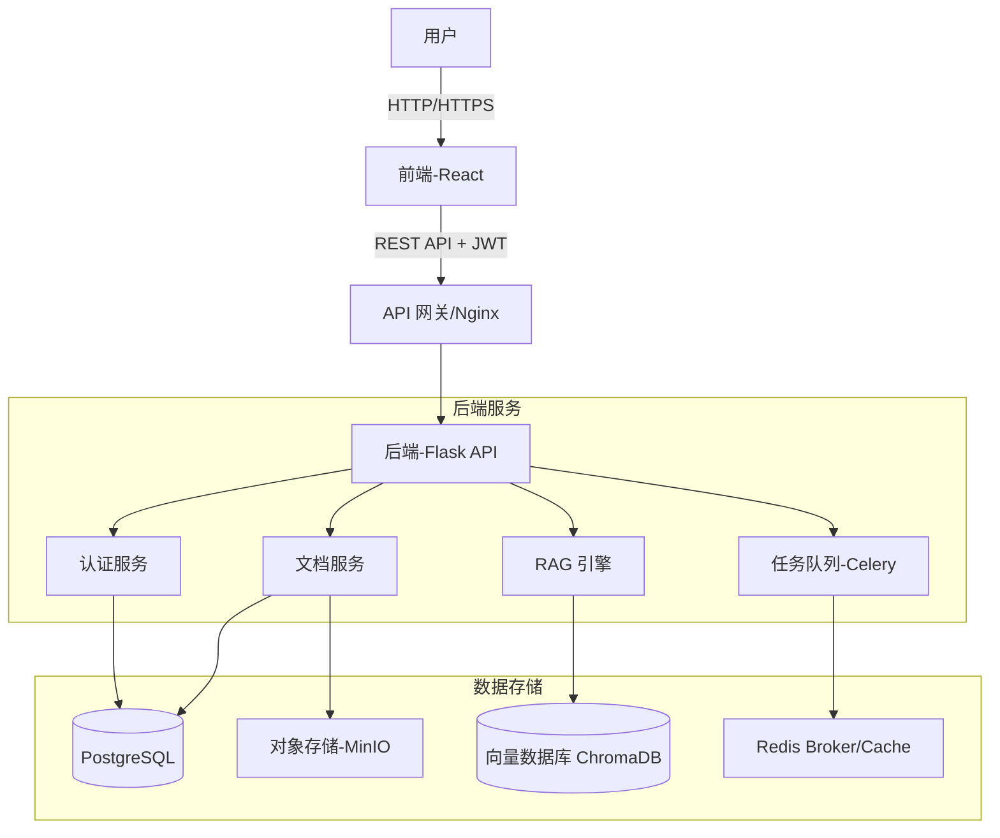

# 技术架构 (Architecture)

## 系统概览

DocuMind-AI 采用经典的前后端分离架构，通过 RESTful API 进行通信。系统的核心设计原则是**模块化**和**用户隔离**。

## 核心组件

### 1. 前端 (Frontend)
- **技术栈**: React, Vite, TailwindCSS, Axios.
- **职责**: 用户界面交互，文件上传，聊天窗口，Token 管理。

### 2. 后端 API (Backend API)
- **技术栈**: Python, Flask, Gunicorn.
- **职责**: 
    - 处理 HTTP 请求。
    - **鉴权 (Authorization)**: 验证 JWT，确保用户只能访问自己的资源 (`user_id` 过滤)。
    - 业务逻辑编排。

### 3. 数据层 (Data Layer)
- **PostgreSQL**: 
    - 存储结构化数据：用户账户、文档元数据（文件名、上传时间、状态）、对话历史。
    - **关键设计**: 所有资源表（如 `documents`, `chats`）都必须包含 `user_id` 外键。
- **MinIO (S3 Compatible)**:
    - 存储非结构化数据：用户上传的原始文档文件（PDF, Word 等）。
- **ChromaDB**:
    - 存储高维向量数据（Document Embeddings）。
    - 支持通过 Metadata (`user_id`) 进行过滤检索。
- **Redis**:
    - Celery 任务队列的 Broker。
    - 缓存热点数据。

## 数据流 (Data Flow)

### 1. 文档上传与处理
1. 用户上传文件 -> 后端接收 -> 存储至 MinIO。
2. 后端在 PostgreSQL 创建文档记录 (Status: Pending)。
3. 后端发送解析任务至 Celery 队列。
4. Celery Worker 获取任务 -> 解析文本 -> 切片 (Chunking) -> 调用 Embedding API -> 存入 ChromaDB。
5. 更新 PostgreSQL 文档状态为 Completed。

### 2. 问答流程 (RAG)
1. 用户发送问题 -> 后端接收。
2. 后端将问题向量化 -> 在 ChromaDB 中检索相关切片 (**强制带上 `user_id` 过滤条件**)。
3. 后端构建 Prompt (包含问题 + 检索到的上下文) -> 调用 LLM。
4. LLM 生成回答 -> 后端返回给用户。
